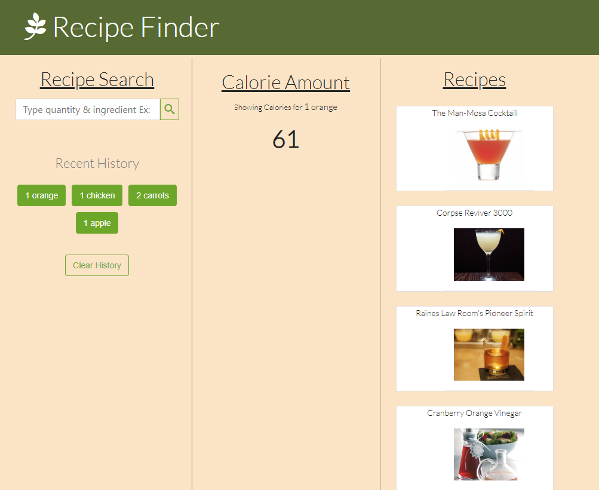

# Recipe-Finder

This application allows the user to type an ingredient and receive the calorie amount and recipes that include said ingredient.

## Built With
- HTML
- CSS 
- Javascript

### API's Used
- Spoontacular
- Edamam Nutrition Info

## Contributors
 - Jordan Carver - [Github](https://github.com/1jorcarver)
 - Roger Saldivar - [Github](https://github.com/salgorog)
 - Bryce Drawe - [Github](https://github.com/bdrawe)

 ## Live URL
 
 https://salgorog.github.io/recipe-finder/